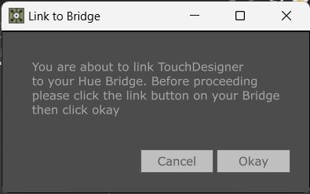

# TouchDesigner Hue Control
*a tox for controlling phillips hue devices*  
[matthew ragan](https://matthewragan.com)  
[zoe sandoval](https://zoesandoval.com)

## TouchDesigner Version
* 099 2023.32660

## OS Support
* Windows 10
* macOS (currently untested)

## Summary
Philips Hue smart lights are intended to be used in homes / studios. The devices come in many varieties - individual lamps, outdoor lights, LED strip lights, etc. These are synchronized by communicating with an additional device called a Bridge. A single Bridge can control up to 50 lights. There are many stand alone applications to drive Hue Lights, and this repo aims to provide some additional control by exposing those controls through TouchDesigner. Previously this was addressed by using the `phue` library - this caused number of challenges for TouchDesigner users looking to install a 3rd party library. In this most recent update, the control mechanics have been changed to work with the latest hue api, and have moved to using just the `requests` library that ships with TouchDesigner.

This TOX provides global control for all lights, or individual control for single lights.

## Use and Installation
The steps below cover a typical installation and use of the `hueControl` TOX.

1. Download the `hueControl` TOX file from the releases page of this repository. Drop the TOX into your network. 
2. Locate and add your bridge IP address - input this IP address into the `Bridgeip` parameter for the TOX.
3. Click the `Link to Bridge` parameter on the TOX. This will prompt you to click the link button on your birdge before clicking `Continue` in TouchDesigner.
4. Click `Initialize Lights` to fetch a list of all of the lights currently configured with your Hue Bridge.
5. Update and control your Hue Lights.

----

## Connecting to the Hue Bridge
Before being able to control lights you'll need to ensure that you can connect to your Hue Bridge. You'll need to know the IP address for your Hue Bridge. You can locate this IP address by looking at the Hue app on your phone, or by setting your Bridge to have an assigned IP on your router.

You'll need to enter the IP address of your Hue Bridge in the `Bridge IP` custom parameter. After entering this address. You'll next click on `Initialize Lights`. This will begin the process of linking to your Bridge - a TouchDesigner pop up window will appear with additional Instructions:

## Parameters

**Initialize Lights** - this parameter will retrieve the dictionary of lights that are currently configured on the Hue Bridge. This will then loop through all of the lights provided by the Bridge and create unique parameters for each light. Specifically it will create pars for:  
* Color
* Brightness
* Power

This gives the user the ability to control each light individual - constructing parameters for each light currently configured on a given bridge. 

**Link to Bridge** - this parameter will begin the process of linking TouchDesigner to your Hue Bridge. This process requires that you Bridge IP is entered into the corresponding custom parameter. When you link to your Hue Bridge, the Device User Name is fetched and stored in a read-only custom parameter, as well as a unique Client Key that is only used by TouchDesigner to control your lights. If these parameters are not set, you need to pulse the `Link to Bridge` parameter.  

**Bridge IP** - The IP address for your Hue Bridge.  

**Device User Name** - A user name generated by the Hue api for connecting to the Hue Bridge. This is generated when linking to the Hue Bridge.   

**Client Key** - A client key generated by the Hue api for connecting to the Hue Bridge. This is generated when linking to the Hue Bridge.  

## Known Issues
### mac OS
* none... yet

## Windows
* none... yet

## Credits
### Inspired by the work of:
[zoe sandoval](zoesandoval.com)  
[lightnotes](https://www.lightnotes.es/)  
[forum inspiration](https://www.derivative.ca/Forum/viewtopic.php?f=4&t=6131)

### Icons
[Material Design Icons by Google](https://material.io/tools/icons/?icon=save_alt&style=baseline)